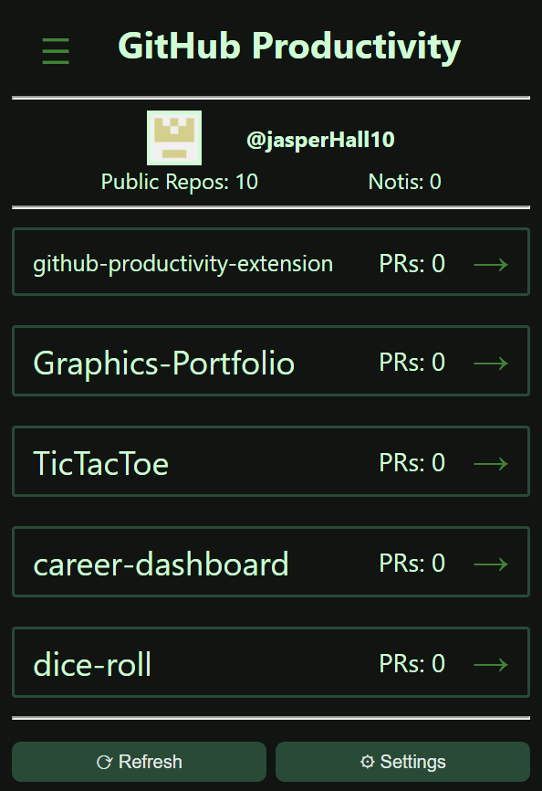
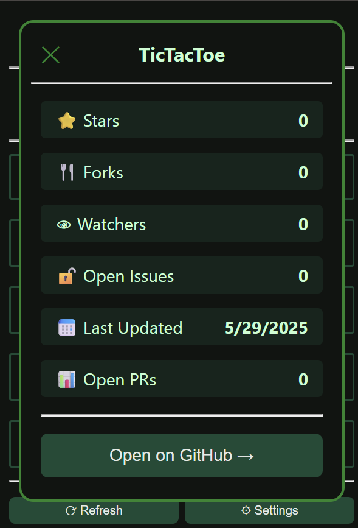
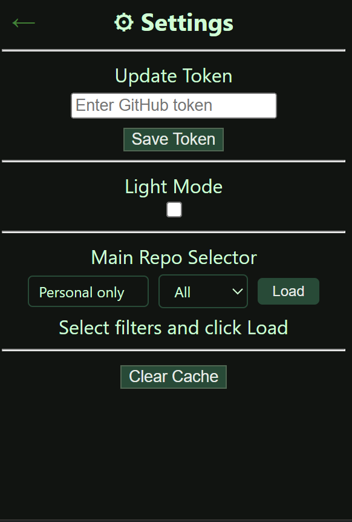

# GitHub Productivity Booster

**A Chrome extension for quick GitHub navigation, repository insights, and streamlined workflow access.**

[](https://developer.chrome.com/docs/extensions/)
[](https://developer.chrome.com/docs/extensions/mv3/intro/)
[](https://docs.github.com/en/rest)
[](LICENSE)


## Installation


### For End Users

1. Go to the [Chrome Web Store](https://chrome.google.com/webstore/category/extensions) and search for "GitHub Productivity Booster" (or use the direct link provided by the project owner).
2. Click **Add to Chrome** and confirm the installation.
3. The extension icon will appear in your toolbar. Click it and enter your GitHub PAT.

### For Developers (Development Install)

1. Clone this repository:
   ```bash
   git clone https://github.com/jasperHall10/github-productivity-extension.git
   ```
2. Open Chrome and go to `chrome://extensions/`.
3. Enable **Developer mode** (top right).
4. Click **Load unpacked** and select the project folder.
5. The extension icon will appear in your toolbar. Click it and enter your GitHub PAT.

### GitHub Token Setup (Required for All Installs)

1. Go to [GitHub Settings → Developer settings → Personal access tokens](https://github.com/settings/tokens)
2. Click **Generate new token (classic)** or **Fine-grained token**
3. Select the required scopes:

   | Scope | Purpose |
   |-------|---------|
   | `repo` | Access private repos and PR counts |
   | `notifications` | Read notifications |
   | `read:org` | List organizations for filtering |

4. Copy the token and paste it into the extension login screen

## Screenshots

<!-- Add screenshots here -->
| Home | Repository Details | Settings |
|:----:|:------------------:|:--------:|
|  |  |  |


## Project Structure

```
github-productivity-extension/
├── .git/                # Git repository data
├── devlog.md            # Development log
├── LICENSE              # MIT License
├── manifest.json        # Extension configuration (Manifest V3)
├── README.md            # Project documentation
├── icons/
│   └── icon128.png      # Extension icon
├── popup/
│   ├── popup.html       # Popup UI markup
│   ├── popup.css        # Popup styles
│   └── popup.js         # Popup logic and API calls
└── screenshots/
   ├── home.png         # Home screen screenshot
   ├── details.png      # Repo details screenshot
   └── settings.png     # Settings screenshot
```


## Technical Highlights

| Area | Implementation |
|------|----------------|
| **API Integration** | Async/await fetch calls to GitHub REST API with rate limit tracking |
| **Token Security** | Regex validation for PAT formats (`ghp_`, `github_pat_`, `gho_`, legacy hex) |
| **State Management** | `chrome.storage.local` for persistence, `chrome.storage.session` for transient data |
| **Error Handling** | User-friendly toast messages and graceful degradation on API errors |
| **Performance** | Caching to minimize API calls and respect rate limits |

---

## Future Roadmap

- [ ] OAuth login flow (replace manual token entry)
- [ ] Notification preview and mark-as-read from extension
- [ ] Extension badge showing unread notification count
- [ ] Recent commits display per repository
- [ ] Custom theme support beyond light/dark
- [ ] Keyboard navigation for accessibility

---

## Contributing

Contributions are welcome (especially with the items above)! Please:

1. Fork the repository
2. Create a feature branch (`git checkout -b feature/amazing-feature`)
3. Commit your changes (`git commit -m 'Add amazing feature'`)
4. Push to the branch (`git push origin feature/amazing-feature`)
5. Open a Pull Request

---

## License

This project is licensed under the MIT License. See [LICENSE](LICENSE) for details.

---

<div align="center">

**[Report Bug | Request Feature](../../issues)**

© 2026 Jasper Hall

*This project is not affiliated with, endorsed by, or sponsored by GitHub, Inc.*

</div>

---
